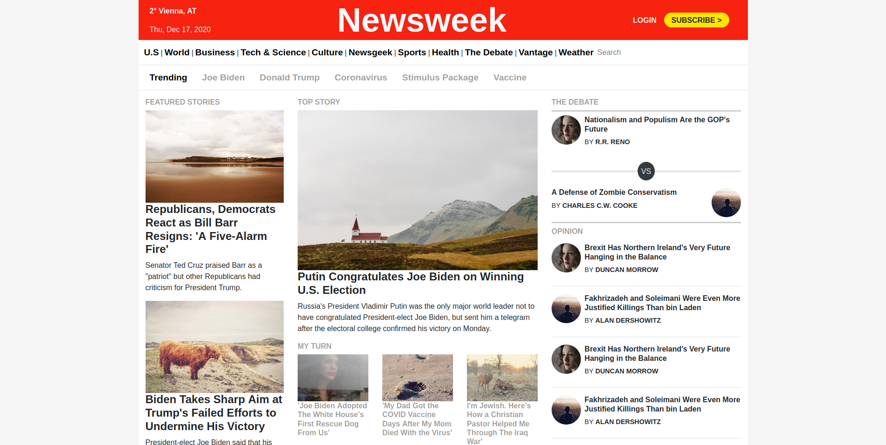

# Using Bootstrap

This project for [The Odin Project](https://www.theodinproject.com) is a clone of the [newsweek homepage](https://www.newsweek.com/) using Bootstrap.

## Reflection

### Reordering

Already in the planning phase I ran into a problem: The original site reorders content on the top of the page at the lowest screen size. The problem here is, that content from different columns (that appear at greater sreen size) is mixed together. This cannot be solved using Bootstrap as it is.

Marking the content up in columns, as the greater screen sizes require, makes the reordering impossible (you can only reorder content inside the same column, that is: siblings. You cannot move content from one column to another).

Not grouping the items together in columns makes it possible to reorder them, but breaks the layout at bigger screen sizes.

This could be solved using a little "hack":

1. Add the stuff that is out of order separately to the html and hide it.
2. At the lowest sreen size, hide everything in the central column except the top story, that goes ... uhm ... to the top and show the hidden stuff at the right spot. However, this adds a bunch of redundant html and seems not very elegant.

And of course, simply using the standard CSS Grid would take care of this problem. However, this project is about practicing Bootstrap, so building it without Bootstrap shouldn't be the goal here... So I decided not to replicate the reordering of the original site.

### Bootstrap Pro's

- The amazing "grid"-System that allows you to set up a responsive layout in no time without any work up-front. Just add in a few `col-*-*` classes and you're ready to go. As noted above, you cannot do everything with it and I would have probably preferred a system based on a real grid instead of something that calls itself "grid", but is really flexbox under the hood. Anyway, in most cases the Bootstrap "grid" will suffice and it is fast and easy.
- It looks good out of the box. Of course, this is all the better the more similar the page looks to vanilla Bootstrap. I therefore think that a news site is a rather bad use case (though this one was made originally using it). A better use case would be some sort of landing page that has a lot of elements like forms, cards, badges, a slider maybe ... that require a lot of styling if you're doing them from scratch.

### Bootstrap Con's

- It adds an extra layer to the project, that is, an extra layer where things can go wrong and break and have to be debugged.
- You really add a bunch of classes, which bloats the markup. And you have to adjust the html so that certain Bootstrap-classes work correctly. Of course, also without Bootstrap it is sometimes necessary to change the html (eg. adding a wrapper to something), but generally I try to avoid it as much as possible.
- Similar to the previous point: Since you're styling stuff by adding/changing classes in the html, when you're making a stylistic change, you have to change ALL the html elements to which the change applies. And if you have a lot of content this is a lot of tedious work.

## Built with

- [Bootstrap](https://getbootstrap.com/)
- [Picsum](https://picsum.photos)

## Demo

[View it here](https://reinimax.github.io/newsweek/)
